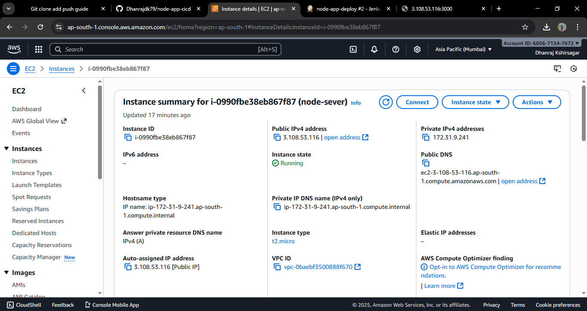
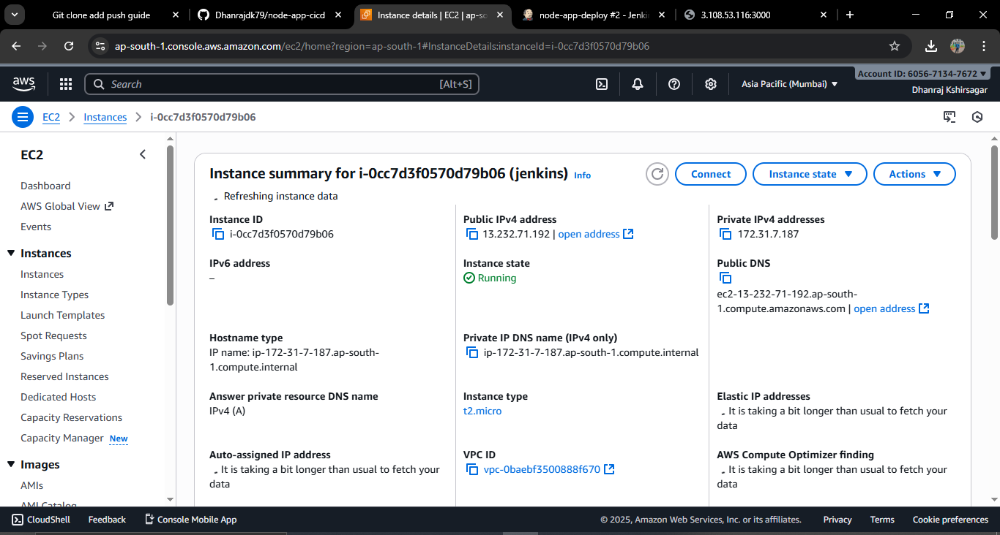
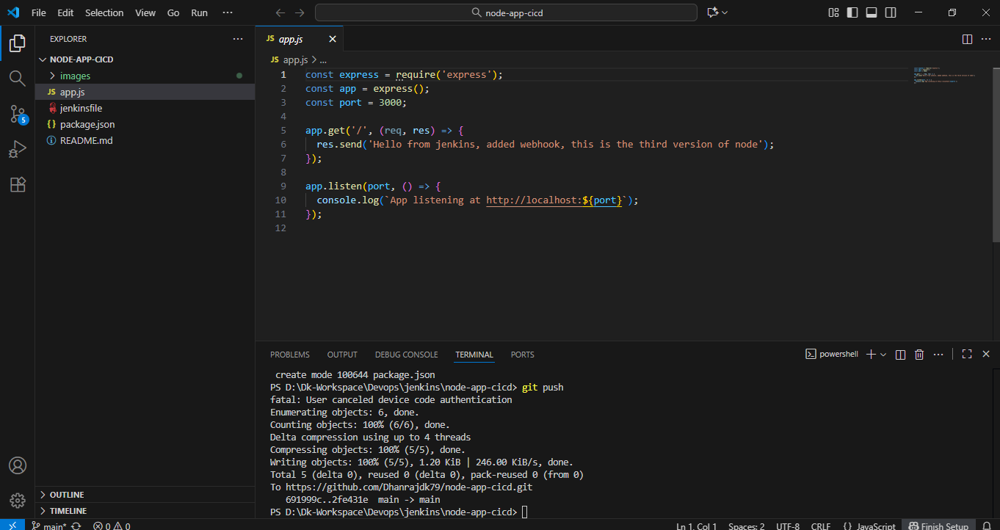
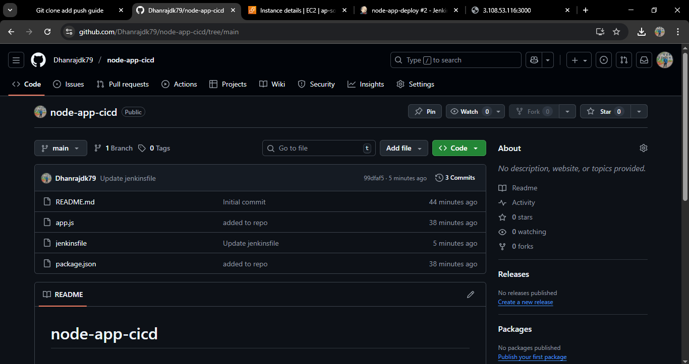
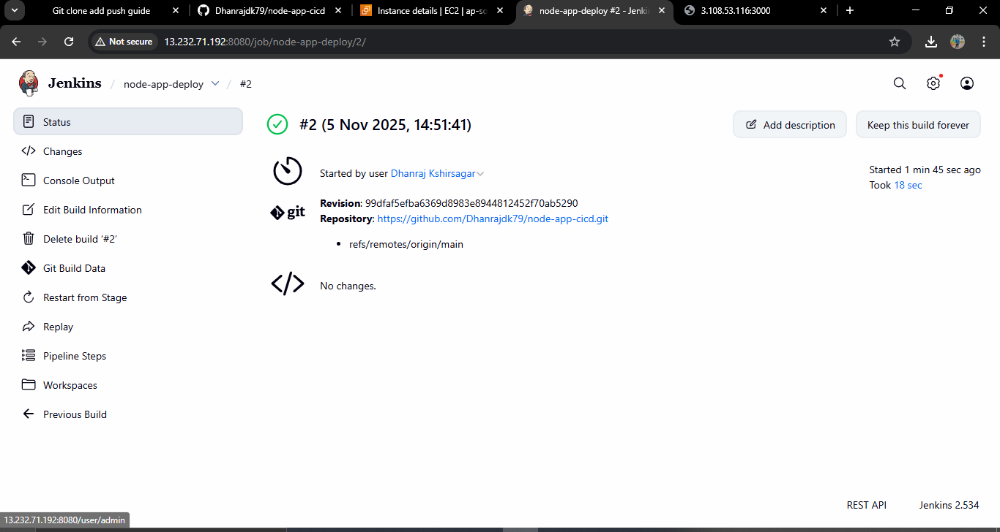
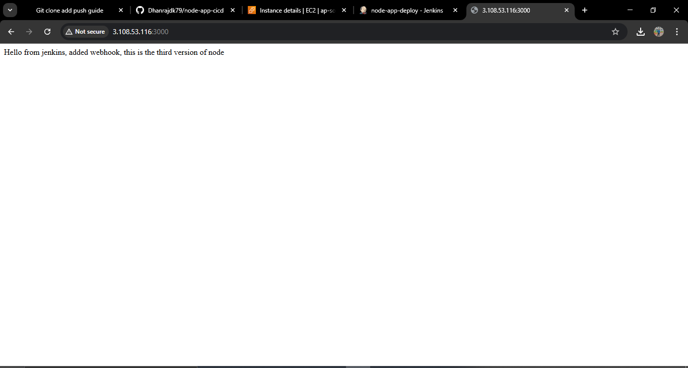

# node-app-cicd
# 🚀 Jenkins CI/CD Pipeline for Node.js App Deployment

This project demonstrates a **Jenkins CI/CD pipeline automation** setup to fetch a Node.js application (`app.js`) from a **GitHub repository**, build and test it, and automatically deploy the code to a **Node.js server**.

## 📁 Project Overview

This Jenkins pipeline automates the following process:

1. **Pull Source Code** – Clone the Node.js project from GitHub.
2. **Install Dependencies** – Install required Node packages using `npm install`.
3. **Build & Test** – Run automated tests or linting if configured.
4. **Deploy** – Deploy the updated application code to a remote Node.js server using SSH.
5. **Start/Restart Server** – Start or restart the Node.js app using `pm2` or `node`.

## ⚙️ Project Structure

jenkins-node-cicd/
├── app.js
├── package.json
├── Jenkinsfile
└── README.md

## Steps 
1. lauching 2 ec2 instances
(node-server)

(Jenkins-server)

2. create an nodejs file, jenkinsfile,
 

3. add and push the code to GIthub
    
4. setup Jenkins and build the project
   

5. Deployement 

